# Анимация снежинок Коха: математические основы и реализация в Asymptote

Данный документ посвящён ответу на следующий вопрос: ["I am trying to make a really cool animation using Koch snowflakes, but don't know how"](https://tex.stackexchange.com/questions/761136/i-am-trying-to-make-a-really-cool-animation-using-koch-snowflakes-but-dont-kno). Мы начнём с определения кривой Коха в аффинной системе координат с базисами $e_1 = \left(\frac{1}{2}, \frac{\sqrt{3}}{2}\right)$, $e_2 = \left(\frac{1}{2}, -\frac{\sqrt{3}}{2}\right)$. Затем определим снежинку Коха с некоторыми дублирующими вершинами, чтобы корректно определить операции сжатия и растяжения. После чего подробнее поговорим о том, из каких кадров состоит анимация и как реализовать нужный угол обзора. В завершение обсудим ряд моментов, касающихся улучшений и альтернативных реализаций.

В данной работе мы будем использовать [Asymptote](https://asymptote.sourceforge.io/) в качестве основного инструмента для демонстрации и реализации анимации. Однако, как будет видно далее, мы сможем использовать любой другой язык для решения задачи, поскольку приведём все математические выкладки.

## Кривая Коха

Создавать кривую Коха можно по-разному; в самом вопросе уже упоминали способ через L-системы. Для нашей задачи не принципиально, каким образом мы получим список вершин кривой, а в дальнейшем снежинки Коха. Однако мне показалось, что использовать для этого рекуррентные формулы будет красиво и гибко. Существует несколько возможных подходов для получения этих формул. С одним из них можно ознакомиться в энциклопедии последовательностей: [A335358](https://oeis.org/A335358). В ней же есть ссылка на [работу](https://docs.google.com/document/d/1FUUuR99WPY3tXgL1XXdOGkiGcfvC2eyh74WIwfZGyvA/view?tab=t.0#heading=h.al1th1rbqpaa) Литвинова А.В., где подробно описан процесс выведения формул в аффинной системе координат с базисом $e_1 = (1,0)$, $e_2 = \left(\frac{1}{2}, \frac{\sqrt{3}}{2}\right)$.

Мы же будем работать в аффинной системе координат с базисом $e_1 = \left(\frac{1}{2}, \frac{\sqrt{3}}{2}\right)$, $e_2 = \left(\frac{1}{2}, -\frac{\sqrt{3}}{2}\right)$, что позволит нам вычислять все вершины кривой, а в дальнейшем и снежинки, в целых координатах. При должном желании всю анимацию можно рассчитать в целых координатах и лишь на этапе вывода на экран выполнить обратное преобразование в декартову систему. Мы же ограничимся тем, что при определённых операциях над снежинкой будем выходить в поле рациональных чисел $\mathbb{Q}$.

Повторяя рассуждения из приведённой выше работы, придём к следующим формулам:

$$
l(n) = \left\lceil \log_4 n \right\rceil + 1
$$

$$
b(n) = \left\lceil \frac{4n}{4^{\lceil \log_4 n \rceil}} \right\rceil
$$

$$
x(n) = \begin{cases}
0, & n = 1;\\
3^{l(n)-2} + y\bigl(n - 4^{l(n)-2}\bigr), & b(n)=2,\\
2\cdot 3^{l(n)-2} + x\bigl(n - 2\cdot 4^{l(n)-2}\bigr) - y\bigl(n - 2\cdot 4^{l(n)-2}\bigr), & b(n)=3,\\
2\cdot 3^{l(n)-2} + x\bigl(n - 3\cdot 4^{l(n)-2}\bigr), & b(n)=4,
\end{cases}
$$

$$
y(n) = \begin{cases}
0, & n = 1;\\
3^{l(n)-2} - x\bigl(n - 4^{l(n)-2}\bigr) + y\bigl(n - 4^{l(n)-2}\bigr), & b(n)=2,\\
2\cdot 3^{l(n)-2} + x\bigl(n - 2\cdot 4^{l(n)-2}\bigr), & b(n)=3,\\
2\cdot 3^{l(n)-2} + y\bigl(n - 3\cdot 4^{l(n)-2}\bigr), & b(n)=4,
\end{cases}
$$

где $n$ – номер вершины ломаной Коха, причём $n \ge 1$.

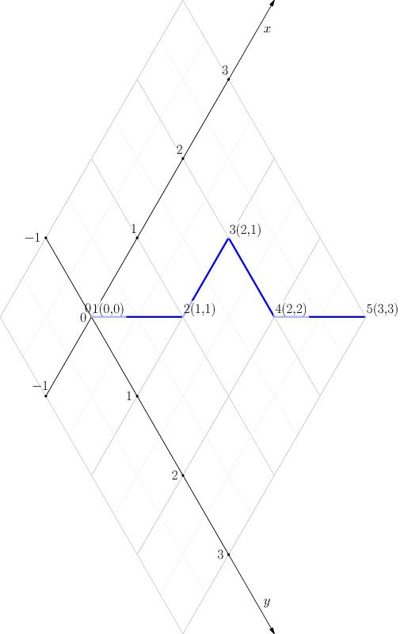
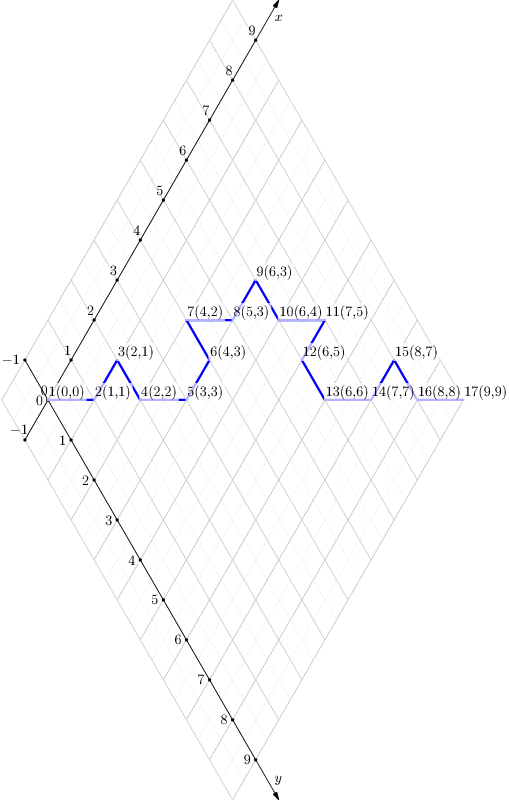

Далее модифицируем приведённые формулы, чтобы кривую можно было строить не только с началом в точке $(0,0)$, но и в произвольной точке $O = (x_0, y_0)$.

$$
x(n) = \begin{cases}
x_0, & n = 1;\\
3^{l(n)-2} + y\bigl(n - 4^{l(n)-2}\bigr) + x_0 - y_0, & b(n)=2,\\
2\cdot 3^{l(n)-2} + x\bigl(n - 2\cdot 4^{l(n)-2}\bigr) - y\bigl(n - 2\cdot 4^{l(n)-2}\bigr) + y_0, & b(n)=3,\\
2\cdot 3^{l(n)-2} + x\bigl(n - 3\cdot 4^{l(n)-2}\bigr), & b(n)=4,
\end{cases}
$$

$$
y(n) = \begin{cases}
y_0, & n = 1;\\
3^{l(n)-2} - x\bigl(n - 4^{l(n)-2}\bigr) + y\bigl(n - 4^{l(n)-2}\bigr) + x_0, & b(n)=2,\\
2\cdot 3^{l(n)-2} + x\bigl(n - 2\cdot 4^{l(n)-2}\bigr) - x_0 + y_0, & b(n)=3,\\
2\cdot 3^{l(n)-2} + y\bigl(n - 3\cdot 4^{l(n)-2}\bigr), & b(n)=4.
\end{cases}
$$

Можно ещё больше обобщить эти формулы, например, учесть длину сегмента между двумя подряд идущими вершинами ломаной. Однако в нашей задаче все снежинки будут одинакового размера, а при помощи задания размеров изображения мы сможем изменять масштаб снежинок.

## Снежинка Коха

Далее необходимо построить снежинку Коха. Здесь уже не получится задать координаты $x$ и $y$ только через номер вершины $n$, поскольку, например, вершина с номером $3$ может иметь координаты $(0,1)$ (первая итерация, $i=1$, когда снежинка представляет собой равносторонний треугольник) или $(2,1)$ (случай $i>1$). Однако, задав номер вершины и номер итерации, можно определить координаты вершины при помощи следующих формул:

$$
x(n,i) = \begin{cases}
x(n), & 1 \le n \le 4^{i-1},\\
3^{i-1} - y\bigl(n - 4^{i-1}\bigr), & 4^{i-1}+1 \le n \le 3\cdot 4^{i-1},
\end{cases}
$$

$$
y(n,i) = \begin{cases}
y(n), & 1 \le n \le 4^{i-1},\\
3^{i-1} + x\bigl(n - 4^{i-1}\bigr) - y\bigl(n - 4^{i-1}\bigr), & 4^{i-1}+1 \le n \le 3\cdot 4^{i-1}.
\end{cases}
$$

Данные формулы верны для $n \ge 1$ и $n \le 3\cdot 4^{i-1}$. Последнее ограничение связано с тем, что в снежинке Коха с номером итерации $i$ всего $3\cdot 4^{i-1}$ вершин.

Если мы хотим построить снежинку с началом в точке $O = (x_0, y_0)$, получим:

$$
x(n,i) = \begin{cases}
x(n), & 1 \le n \le 4^{i-1},\\
3^{i-1} - y\bigl(n - 4^{i-1}\bigr) + x_0 + y_0, & 4^{i-1}+1 \le n \le 3\cdot 4^{i-1},
\end{cases}
$$

$$
y(n,i) = \begin{cases}
y(n), & 1 \le n \le 4^{i-1},\\
3^{i-1} + x\bigl(n - 4^{i-1}\bigr) - y\bigl(n - 4^{i-1}\bigr) - x_0 + 2y_0, & 4^{i-1}+1 \le n \le 3\cdot 4^{i-1}.
\end{cases}
$$

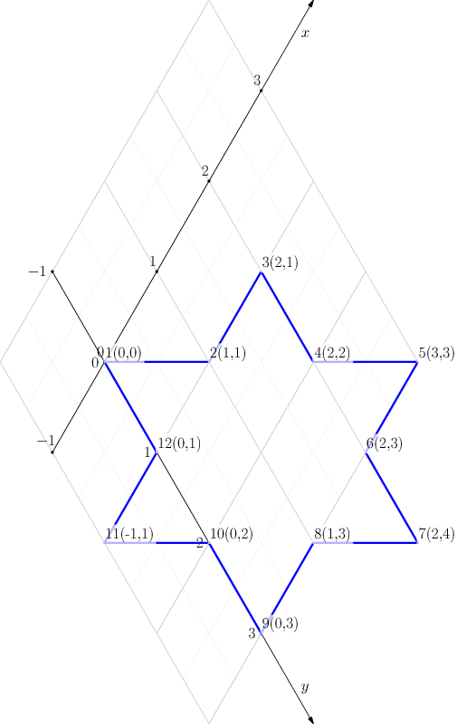
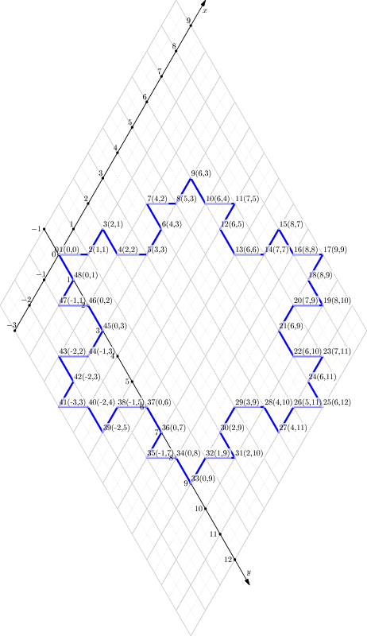

## Операции над снежинками

### Перемещение

Давайте взглянем на один из первых кадров, повёрнутого на $30$ градусов, в предоставленном видео:

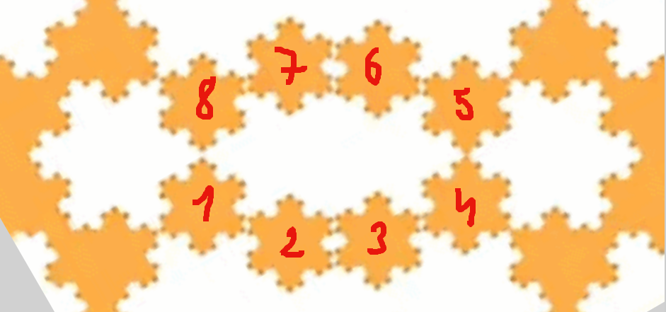

Для удобства пронумеруем некоторые снежинки.

Заметим, что снежинка $8$ находится строго выше снежинки $1$, причём будем считать, что снежинка $8$ соприкасается со снежинкой $1$, как и снежинка $5$ со снежинкой $4$. На фото видна незначительная разница – спишем её на плохое качество видео и погрешность между $k$-м и $k+1$-м кадром. Снежинки $2$ и $3$ находятся на одной горизонтали. При этом снежинка $7$ относительно снежинки $8$ находится правее и выше.

Продолжая рассматривать эти $8$ снежинок, мы придём к тому, что можно выделить $8$ интересующих нас направлений. Пусть $S = (x, y)$ – произвольная точка в аффинной системе координат. Определим следующие векторы смещения:

1. **N** (North) – смещение $S + (2k, -2k)$;
2. **S** (South) – смещение $S + (-2k, 2k)$;
3. **W** (West) – смещение $S + (-3k, -3k)$;
4. **E** (East) – смещение $S + (3k, 3k)$;
5. **NE** (North-East) – смещение $S + (4k-1, 2k+1)$;
6. **NW** (North-West) – смещение $S + (-2k-1, -4k+1)$;
7. **SE** (South-East) – смещение $S + (2k+1, 4k-1)$;
8. **SW** (South-West) – смещение $S + (-4k+1, -2k-1)$.

Здесь $k = 3^{i-2}$, где $i$ (iterations) – номер итерации снежинки. Для $i = 2$ получим:

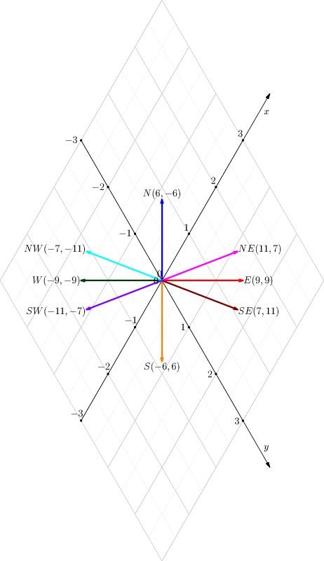

Имея эти векторы смещения, мы можем построить снежинку под номером $1$ и затем относительно неё построить все $8$ ранее рассмотренных снежинок.

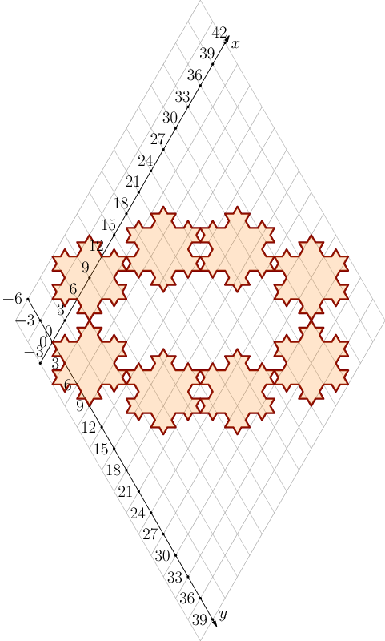
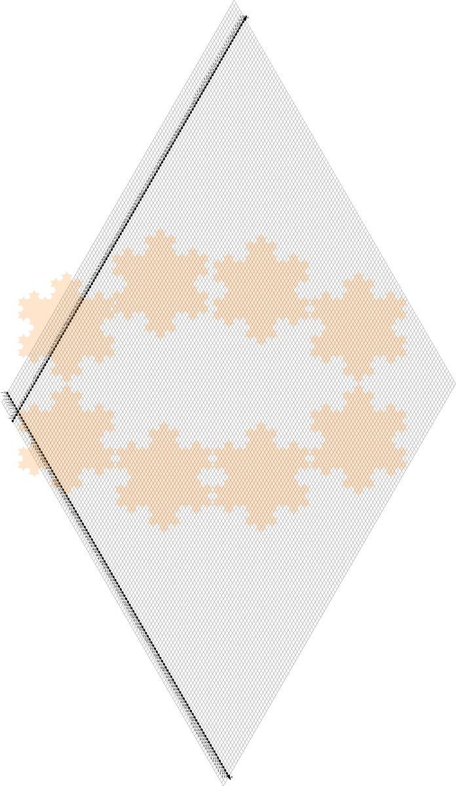

### Растяжение и сжатие

Зафиксируем один кадр видео и продублируем его с наложением, чтобы одинаковые части совпали:

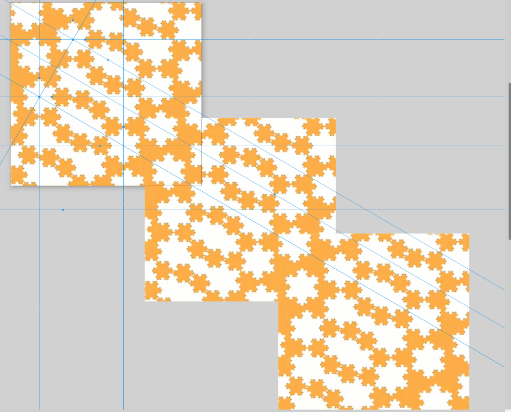

Для удобства повернём их на $30$ градусов и рассмотрим подробнее элементы, похожие на растянутые снежинки Коха:

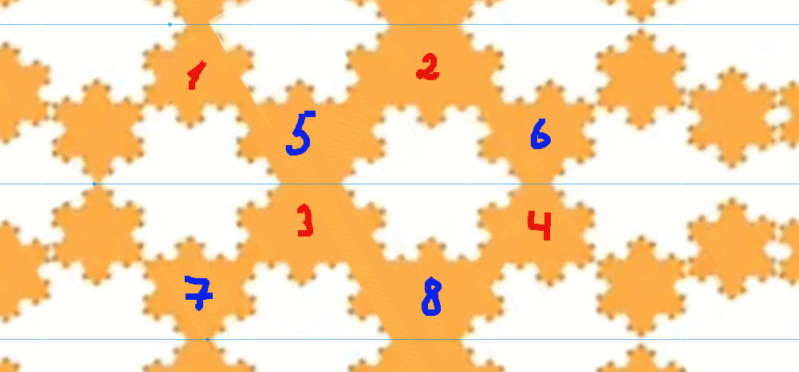

Далее эти растянутые объекты продолжим называть просто снежинками. Можно заметить, что в снежинках с $1$ по $4$ (красные номера) и в снежинках с $5$ по $8$ (синие номера) просматриваются следующие треугольники:

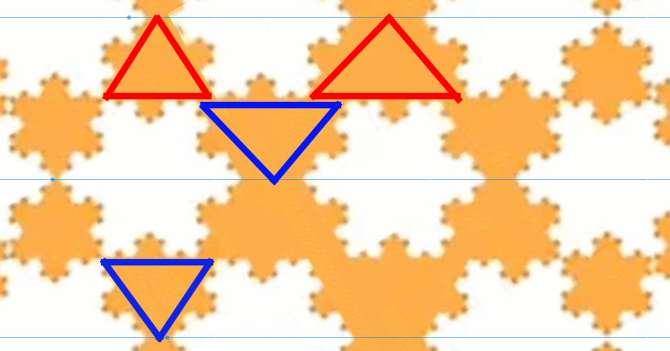

Опишем это формально. Для этого сначала слегка изменим снежинки: добавим ещё $6$ дополнительных вершин, которые дублируют уже существующие вершины с номерами  
$n = 1,\; 2\cdot 4^{i-2}+1,\; 4\cdot 4^{i-2}+1,\; 6\cdot 4^{i-2}+1,\; 8\cdot 4^{i-2}+1,\; 10\cdot 4^{i-2}+1$. Соответственно изменится нумерация. Проиллюстрируем сказанное примером для $i=2$:

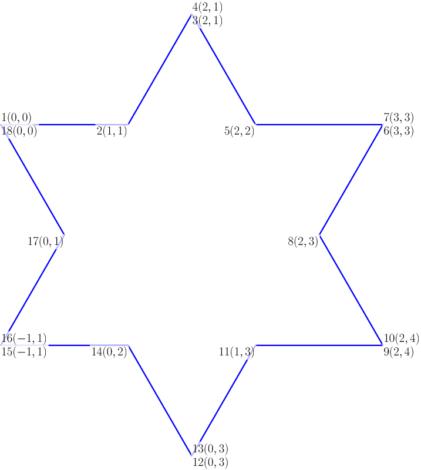

Теперь мы можем разбить множество вершин на $6$ пересекающихся частей. Для этого рассмотрим множество номеров вершин $\left[1;\;12\cdot 4^{i-2}+6\right]$. Части определяются так:

1. $\left[1;\;4\cdot 4^{i-2}+2\right]$; для $i=2$: $[1;6]$;
2. $\left[2\cdot 4^{i-2}+2;\;6\cdot 4^{i-2}+3\right]$; для $i=2$: $[4;9]$;
3. $\left[4\cdot 4^{i-2}+3;\;8\cdot 4^{i-2}+4\right]$; для $i=2$: $[7;12]$;
4. $\left[6\cdot 4^{i-2}+4;\;10\cdot 4^{i-2}+5\right]$; для $i=2$: $[10;15]$;
5. $\left[8\cdot 4^{i-2}+5;\;12\cdot 4^{i-2}+6\right]$; для $i=2$: $[13;18]$;
6. $\left[10\cdot 4^{i-2}+6;\;12\cdot 4^{i-2}+6\right] \cup \left[0;\;2\cdot 4^{i-2}+1\right]$; для $i=2$: $[16;18] \cup [0;3]$.

Если применять операции сдвига лишь для определённых частей снежинок, а не для всей целиком, то можно получить необходимый результат. Для снежинок с красным номером применяем сдвиг к частям $2$, $4$ и $6$; для снежинок с синим номером – к частям $1$, $3$ и $5$. Соответствующая функция выглядит так:

```c++
void stretching_part(int part, int iterations, pair[] snowV, pair dxy) {
  assert(part > 0 && part < 7, 
        "part должна быть между 1 и 6 (включая границы)");
  int k = 4^(iterations - 2);
  if (part > 0 && part < 6) {
    for (int n = 2*(part - 1)*k + (part - 1); 
             n <= 2*(part + 1)*k + part; ++n) {
      snowV[n] = snowV[n] + dxy;
    } 
  } else if (part == 6) {
    for (int n = 10*k + 5; n <= 12*k + 5; ++n) {
      snowV[n] = snowV[n] + dxy;
    }
    for (int n = 0; n <= 2*k; ++n) {
      snowV[n] = snowV[n] + dxy;
    }
  }  
}
```

Теперь изобразим растянутые снежинки. Создадим $8$ снежинок:

```c++
pair[][] snowV; 
int k = 3^(iterations - 2);
snowV.push(snowflake_vertexs(iterations));
snowV.push(snowflake_vertexs(iterations, (2*3^(iterations-2), 4*3^(iterations-2)))); 
snowV.push(snowflake_vertexs(iterations, (6*3^(iterations-2), 6*3^(iterations-2)))); 
snowV.push(snowflake_vertexs(iterations, (8*3^(iterations-2), 10*3^(iterations-2)))); 

snowV.push(snowflake_vertexs(iterations, 
  (-4*3^(iterations-2), 4*3^(iterations-2))
)); 
snowV.push(snowflake_vertexs(iterations, 
  (0, 6*3^(iterations-2))
)); 
snowV.push(snowflake_vertexs(iterations, 
  (2*3^(iterations-2), 10*3^(iterations-2))
)); 
snowV.push(snowflake_vertexs(iterations, 
  (6*3^(iterations-2), 12*3^(iterations-2))
)); 
```

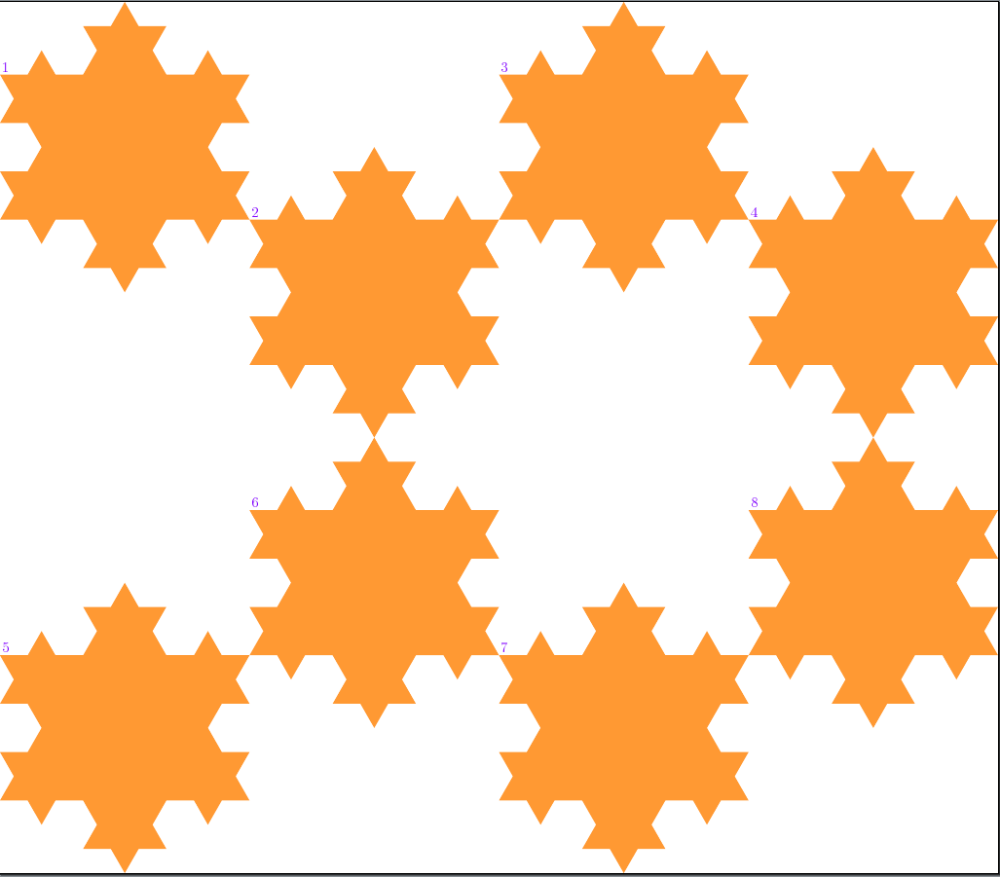

Выполним операции растяжения:

```c++
stretching_part(2, iterations, snowV[0], (1*(iterations-1), 1*(iterations-1)));

stretching_part(1, iterations, snowV[1], (1*(iterations-1), 1*(iterations-1)));
stretching_part(3, iterations, snowV[1], (4*(iterations-1), 4*(iterations-1)));

stretching_part(2, iterations, snowV[2], (6*(iterations-1), 6*(iterations-1)));
stretching_part(4, iterations, snowV[2], (4*(iterations-1), 4*(iterations-1)));
stretching_part(6, iterations, snowV[2], (1*(iterations-1), 1*(iterations-1)));

stretching_part(1, iterations, snowV[3], (6*(iterations-1), 6*(iterations-1)));
stretching_part(3, iterations, snowV[3], (6*(iterations-1), 6*(iterations-1)));
stretching_part(5, iterations, snowV[3], (4*(iterations-1), 4*(iterations-1)));

stretching_part(3, iterations, snowV[4], (1*(iterations-1), 1*(iterations-1)));

stretching_part(2, iterations, snowV[5], (4*(iterations-1), 4*(iterations-1)));
stretching_part(4, iterations, snowV[5], (1*(iterations-1), 1*(iterations-1)));

stretching_part(1, iterations, snowV[6], (4*(iterations-1), 4*(iterations-1)));
stretching_part(3, iterations, snowV[6], (6*(iterations-1), 6*(iterations-1)));
stretching_part(5, iterations, snowV[6], (1*(iterations-1), 1*(iterations-1)));

stretching_part(2, iterations, snowV[7], (6*(iterations-1), 6*(iterations-1)));
stretching_part(4, iterations, snowV[7], (6*(iterations-1), 6*(iterations-1)));
stretching_part(6, iterations, snowV[7], (4*(iterations-1), 4*(iterations-1)));
```

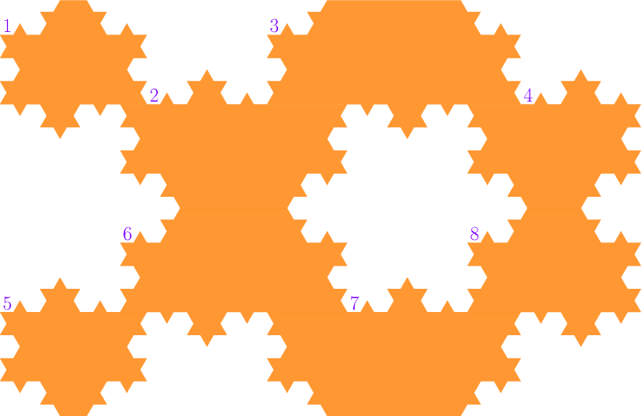
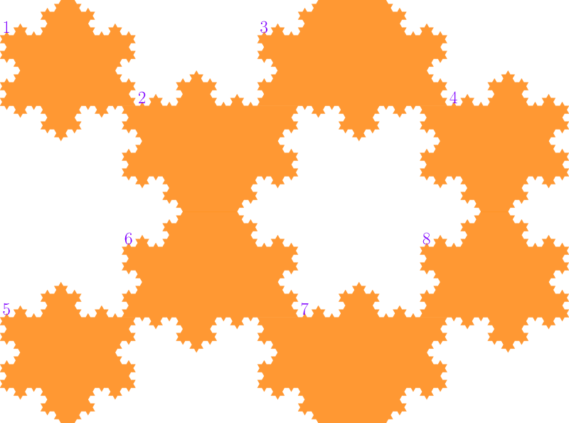

Отметим, что в $(1\cdot(i-1), 1\cdot(i-1))$ коэффициенты подобраны так, чтобы результат растяжения был похож на то, что мы видели в кадре. Мы добавляем $i-1$, чтобы сохранить пропорции: расстояние между первой и второй снежинкой меньше, чем между второй и третьей, даже для снежинок более высоких порядков.

Аналогично подбираются и остальные коэффициенты. Как увидим далее, эти коэффициенты играют ключевую роль в определении периода всей анимации.

## Подготовка к созданию анимации

Прежде чем приступить к созданию анимации, заметим красивое соотношение:

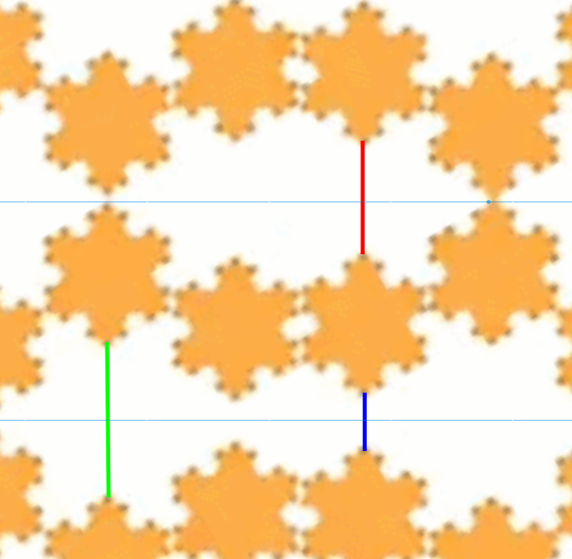

Если положить расстояние, отмеченное синим цветом, равным $S$, то расстояние, отмеченное красным, будет $2S$, а зелёным – $3S$.

Также заметим, что спустя $15$ снежинок получается повторение:

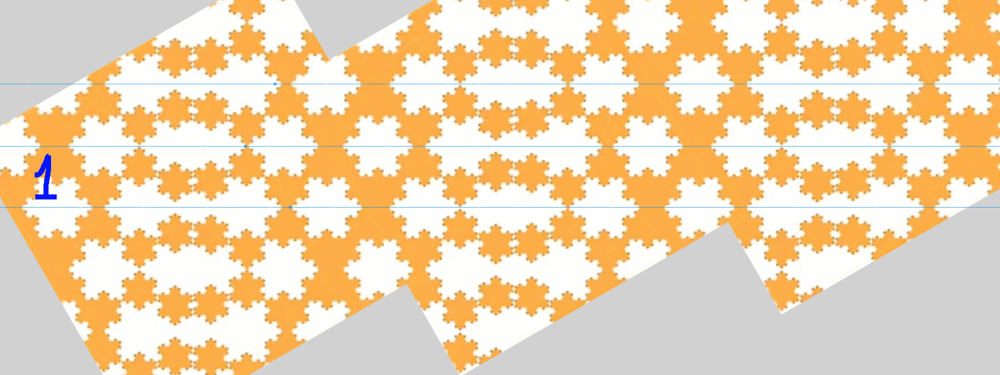

Нас в первую очередь будет интересовать промежуток, отмеченный цифрой $1$.

Теперь откроем GIF-изображение из вопроса, например, в GIMP, и проанализируем каждый из $20$ кадров. Нас будет интересовать траектория движения снежинок. Можно анализировать непосредственно видео, но здесь точность не столь важна, поэтому проще рассматривать меньшее число кадров. Также далее мы мысленно будем поворачивать изображение на $30$ градусов то в одну, то в другую сторону.

Изначально картина следующая:

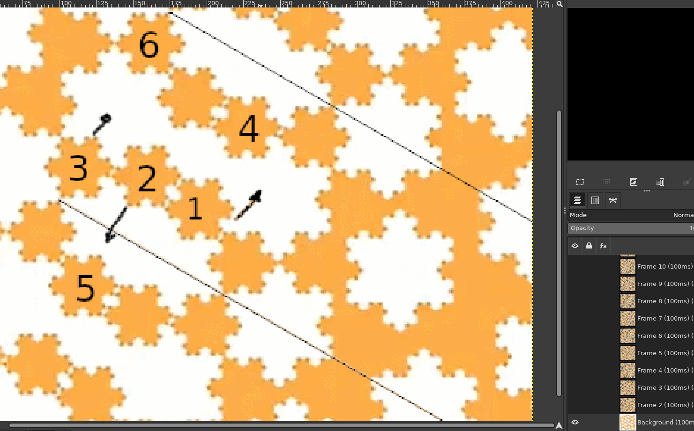

Между снежинками $1$ и $4$ расстояние $S$, между $2$ и $5$ – $2S$, между $3$ и $6$ – $3S$. Направления движения показаны стрелками.

На третьем фрейме получим:

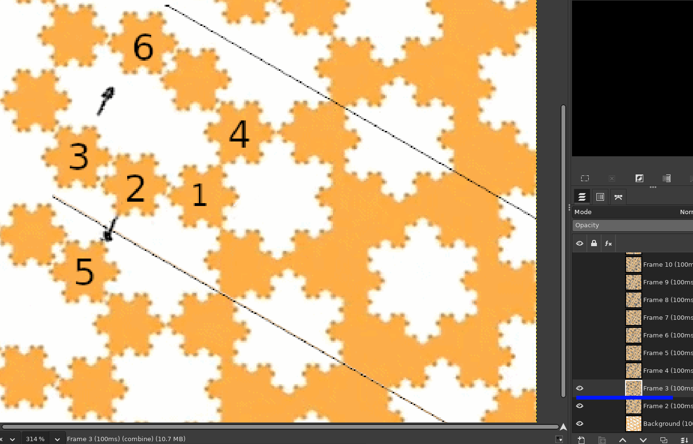

Снежинки $1$ и $4$ соприкоснутся, между $2$ и $5$ расстояние станет $S$, между $3$ и $6$ – $2S$. Также на этом фрейме снежинки после $1$ и $4$ образуют уже знакомый паттерн, который мы создавали при рассмотрении операции сжатия и растяжения.

На пятом фрейме:

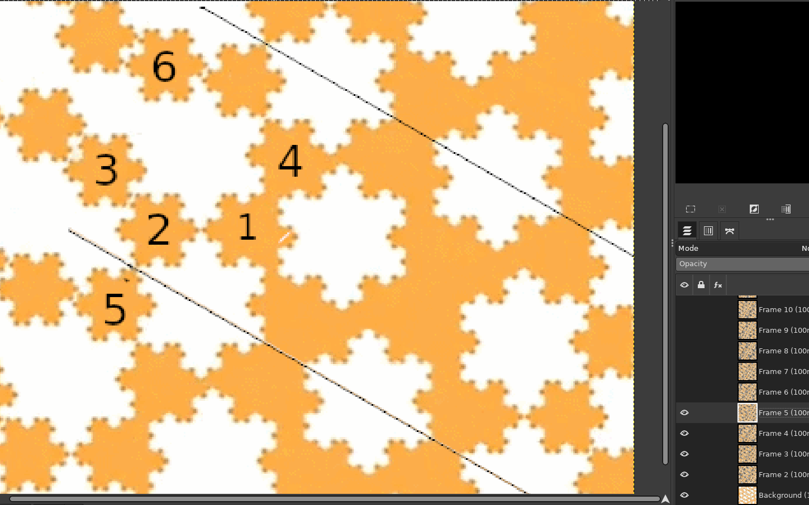

Снежинки $2$ и $5$ соприкоснутся, между $3$ и $6$ расстояние станет $S$.

На седьмом фрейме:

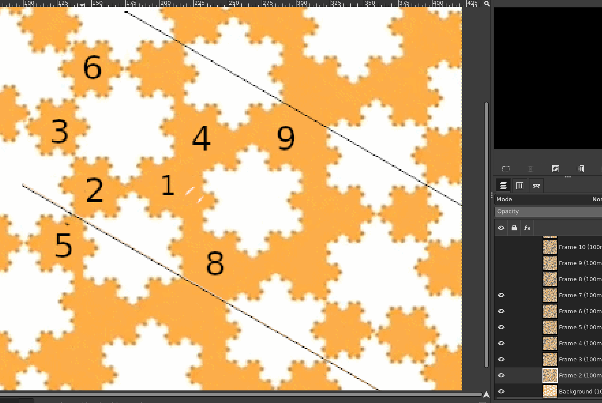

Снежинки $3$ и $6$ соприкоснутся.

## Создание первого фрейма

Перейдём непосредственно к реализации.

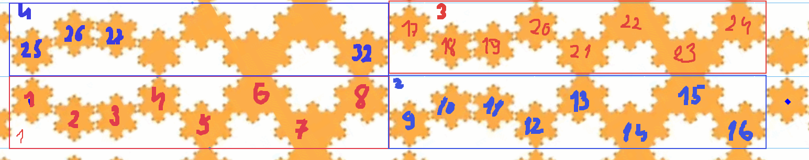

Первым делом создадим красный блок с номером $1$, затем блок $2$. Их создание уже знакомо. Затем создадим блок $3$ как копию блока $1$ со смещением. Аналогично создадим блок $4$ как копию блока $2$.

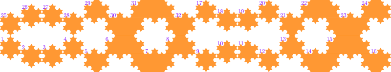

## Основная функция анимации

Реализуем анимацию следующим образом:

```c++
int steps = 4;
int all_frame = 16*steps; // 16 * steps

animation a = animation(prefix="snowflake_animation");
a.add(frame1);

for (int i = 0; i <= all_frame - 1; ++ i){
  picture pic;
  size(pic, width, height);
  for(int n = 0; n < snowV.length # 16; ++n){
      snowV[n*16    ] = update_snowflake_by_frame(pic, 
                              (i)          % all_frame+1, snowV[n*16    ]);
      snowV[n*16 + 1] = update_snowflake_by_frame(pic, 
                              (i+9*steps)  % all_frame+1, snowV[n*16 + 1]);
      snowV[n*16 + 2] = update_snowflake_by_frame(pic, 
                              (i+2*steps)  % all_frame+1, snowV[n*16 + 2]);
      snowV[n*16 + 3] = update_snowflake_by_frame(pic, 
                              (i+11*steps) % all_frame+1, snowV[n*16 + 3]);
      snowV[n*16 + 4] = update_snowflake_by_frame(pic, 
                              (i+4*steps)  % all_frame+1, snowV[n*16 + 4]);
      snowV[n*16 + 5] = update_snowflake_by_frame(pic, 
                              (i+13*steps) % all_frame+1, snowV[n*16 + 5]);
      snowV[n*16 + 6] = update_snowflake_by_frame(pic, 
                              (i+6*steps)  % all_frame+1, snowV[n*16 + 6]);
      snowV[n*16 + 7] = update_snowflake_by_frame(pic, 
                              (i+15*steps) % all_frame+1, snowV[n*16 + 7]);

      snowV[n*16 +  8] = update_snowflake_by_frame(pic, 
                              (i+8*steps) % all_frame+1, snowV[n*16 +  8]); 
      snowV[n*16 +  9] = update_snowflake_by_frame(pic, 
                              (i+1*steps) % all_frame+1, snowV[n*16 +  9]);
      snowV[n*16 + 10] = update_snowflake_by_frame(pic, 
                              (i+10*steps)% all_frame+1, snowV[n*16 + 10]); 
      snowV[n*16 + 11] = update_snowflake_by_frame(pic, 
                              (i+3*steps) % all_frame+1, snowV[n*16 + 11]);
      snowV[n*16 + 12] = update_snowflake_by_frame(pic, 
                              (i+12*steps)% all_frame+1, snowV[n*16 + 12]);
      snowV[n*16 + 13] = update_snowflake_by_frame(pic, 
                              (i+5*steps) % all_frame+1, snowV[n*16 + 13]);
      snowV[n*16 + 14] = update_snowflake_by_frame(pic, 
                              (i+14*steps)% all_frame+1, snowV[n*16 + 14]);
      snowV[n*16 + 15] = update_snowflake_by_frame(pic, 
                              (i+7*steps) % all_frame+1, snowV[n*16 + 15]);
  }

  a.add(pic);
}
```

Основную работу выполняет функция `update_snowflake_by_frame`:

```c++
pair[] update_snowflake_by_frame(picture pic, int frame_number, pair[] snowV) {
  int i = iterations;
  if (1 <= frame_number && frame_number <= steps) {
      shift_snowflake(snowV, (-1/steps, 1/steps));
  } else if (steps + 1 <= frame_number && frame_number <= 2*steps) {
      shift_snowflake(snowV, (-1/steps, 1/steps));
  } else if (2*steps + 1 <= frame_number && frame_number <= 3*steps) {
      shift_snowflake(snowV, (-1/steps, 1/steps));
  } else if (3*steps + 1 <= frame_number && frame_number <= 4*steps) {
      stretching_part(3, i, snowV, (1*(i-1)/steps, 1*(i-1)/steps));
  } else if (4*steps + 1 <= frame_number && frame_number <= 5*steps) {
      stretching_part(1, i, snowV, (1*(i-1)/steps, 1*(i-1)/steps));
      stretching_part(3, i, snowV, (3*(i-1)/steps, 3*(i-1)/steps));
  } else if (5*steps + 1 <= frame_number && frame_number <= 6*steps) {
      stretching_part(1, i, snowV, (3*(i-1)/steps, 3*(i-1)/steps));
      stretching_part(3, i, snowV, (2*(i-1)/steps, 2*(i-1)/steps));
      stretching_part(5, i, snowV, (1*(i-1)/steps, 1*(i-1)/steps));
  } else if (6*steps + 1 <= frame_number && frame_number <= 7*steps) {
      stretching_part(1, i, snowV, (2*(i-1)/steps, 2*(i-1)/steps));
      stretching_part(5, i, snowV, (3*(i-1)/steps, 3*(i-1)/steps));
  } else if (7*steps + 1 <= frame_number && frame_number <= 8*steps) {
      stretching_part(5, i, snowV, (2*(i-1)/steps, 2*(i-1)/steps));
  } else if (8*steps + 1 <= frame_number && frame_number <= 9*steps) {
      shift_snowflake(snowV, (1/steps, -1/steps));
  } else if (9*steps + 1 <= frame_number && frame_number <= 10*steps) {
      shift_snowflake(snowV, (1/steps, -1/steps));
  } else if (10*steps + 1 <= frame_number && frame_number <= 11*steps) {
      shift_snowflake(snowV, (1/steps, -1/steps));
  } else if (11*steps + 1 <= frame_number && frame_number <= 12*steps) {
    stretching_part(2, i, snowV, (1*(i-1)/steps, 1*(i-1)/steps));
  } else if (12*steps + 1 <= frame_number && frame_number <= 13*steps) {
    stretching_part(2, i, snowV, (3*(i-1)/steps, 3*(i-1)/steps));
    stretching_part(4, i, snowV, (1*(i-1)/steps, 1*(i-1)/steps));
  } else if (13*steps + 1 <= frame_number && frame_number <= 14*steps) {
    stretching_part(2, i, snowV, (2*(i-1)/steps, 2*(i-1)/steps));
    stretching_part(4, i, snowV, (3*(i-1)/steps, 3*(i-1)/steps));
    stretching_part(6, i, snowV, (1*(i-1)/steps, 1*(i-1)/steps));
  } else if (14*steps + 1 <= frame_number && frame_number <= 15*steps) {
    stretching_part(4, i, snowV, (2*(i-1)/steps, 2*(i-1)/steps));
    stretching_part(6, i, snowV, (3*(i-1)/steps, 3*(i-1)/steps));
  } else if (15*steps + 1 <= frame_number && frame_number <= 16*steps) {
    stretching_part(6, i, snowV, (2*(i-1)/steps, 2*(i-1)/steps));
  } else {
    abort(format("Error: Invalid frame number = %d", frame_number));
  }
  path snow = T*graph(snowV)--cycle;
  fill(pic, snow, color_snowflake);
  return snowV;
}
```

Всего имеется $16$ основных этапов анимации. Чтобы добавить дополнительную плавность, каждый этап разбивается на `steps` шагов. Именно здесь мы впервые используем операции с рациональными числами. Если бы мы хотели этого избежать, можно было бы изменить масштаб снежинок так, чтобы, например, первая вершина имела координаты $(0,0)$, а вторая – не $(1,1)$, а $(\text{steps}, \text{steps})$.

Также отметим, чтобы снежинка, например, с номером $1$, прошла все $16$ стадий, каждая из которых состоит из `steps` шагов, необходимо $\text{all\_frames} = 16 \cdot \text{steps}$ кадров. При этом через `all_frames` она сместится на $12\cdot (i-1)$, где $i$ – выбранный номер итерации снежинки. К этому мы ещё вернёмся, а пока поговорим об области обзора и нужном нам угле.

## Видимая область

Поскольку отображение в итоге будет в декартовой системе координат, необходимо выполнить преобразование. Согласно [документации Asymptote](https://asymptote.sourceforge.io/doc/Transforms.html):

```txt
Asymptote makes extensive use of affine transforms. A pair (x,y) is transformed 
by the transform t=(t.x,t.y,t.xx,t.xy,t.yx,t.yy) to (x',y'), where

x' = t.x + t.xx * x + t.xy * y
y' = t.y + t.yx * x + t.yy * y

This is equivalent to the PostScript transformation [t.xx t.yx t.xy t.yy t.x t.y].
```

Соответственно, в нашем случае это выглядит так:

```c++
pair e1 = (1/2, sqrt(3)/2);
pair e2 = (1/2, -sqrt(3)/2);
transform T = (0,0,e1.x, e2.x, e1.y, e2.y); // affine -> Cartesian
```

Поскольку нам ещё необходимо выполнить поворот на $30$ градусов, окончательно получим:

```c++
pair e1_rot = rotate(-30) * e1;
pair e2_rot = rotate(-30) * e2;
transform T = (0,0, e1_rot.x, e2_rot.x, e1_rot.y, e2_rot.y);
```

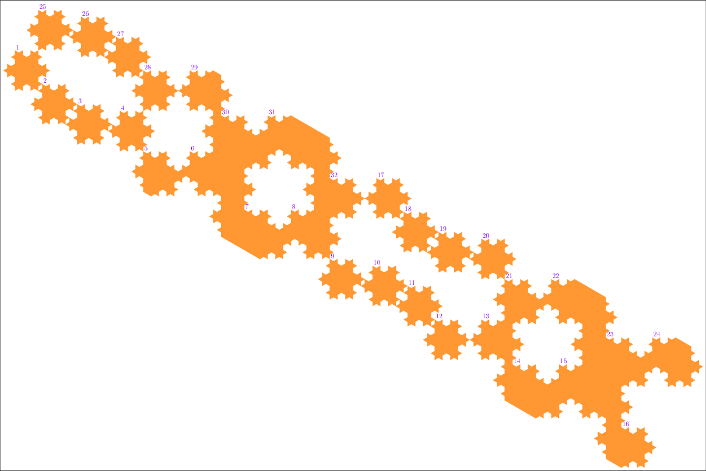

Заметим, что изначально на видео видны два полных овала; один из них образуют снежинки с номерами $1$–$4$ и $25$–$28$. Выполним дублирование несколько раз по вертикали и один раз по горизонтали (по горизонтали необходимо для бесшовности анимации).

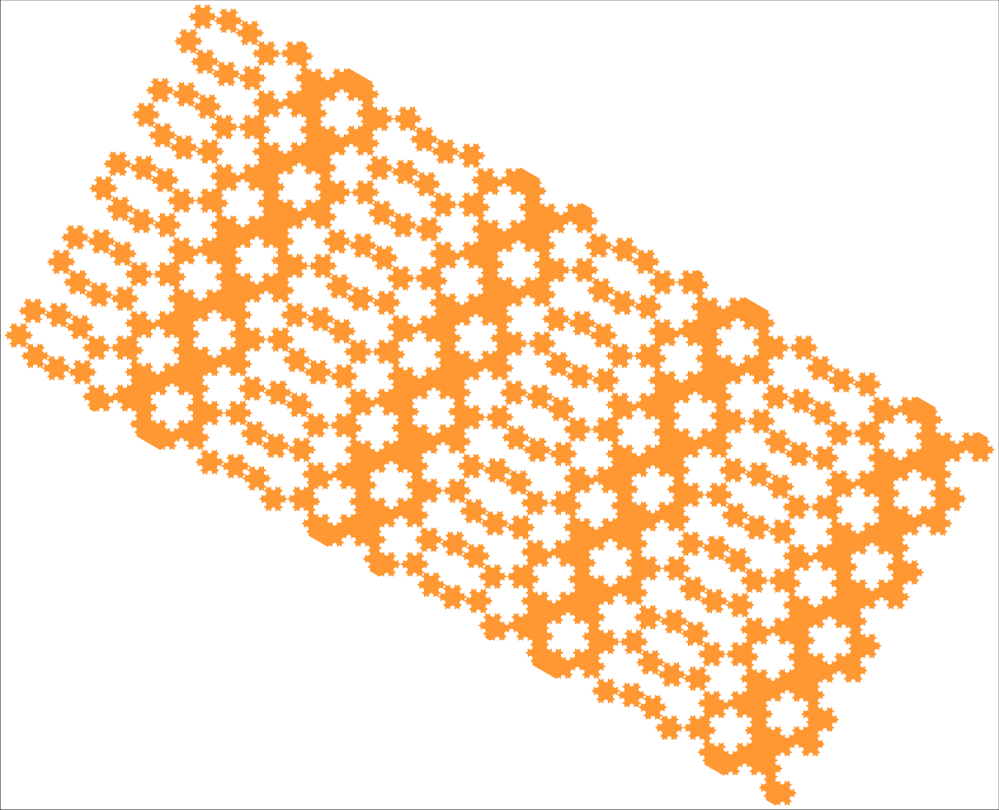

Далее выделим прямоугольник, по которому будем производить обрезку. Из видео трудно строго задать его формально. С одной стороны, кажется, что это просто некий квадрат, однако при замерах обнаружим, что его ширина $422$ пикселя, а высота $406$. Возможно, это погрешность (как и с углом поворота – если измерить его в Inkscape, получим $30.19514^\circ$). Поскольку нет задачи воспроизвести точность до пикселя, положим угол наклона $30^\circ$, а видимый прямоугольник определим так:

```c++
real xmin = 2.82*(24*3^(iterations-2) +6*(iterations - 1)); 
real xmax = 3.71*(24*3^(iterations-2) +6*(iterations - 1));
real ymin = ((1.6*6 - 2.5)*3^(iterations - 2));
real ymax = ((3.45*6 - 2.5)*3^(iterations - 2));

pair A = T * ((xmin+ymax), (xmin-ymax));// Left Top
pair B = T * ((xmin+ymin), (xmin-ymin));// Left Bot
pair C = T * ((xmax+ymin), (xmax-ymin));
pair D = T * ((xmax+ymax), (xmax-ymax));
path viewRect = A--B--C--D--cycle;

// Constructing an axial rectangle
pair Aprime = (B.x, A.y);
pair Bprime = (B.x, C.y);
pair Cprime = (D.x, C.y);
pair Dprime = (D.x, A.y);

real width = abs(D.x - B.x);
real height = abs(A.y - C.y);
write("width = " + string(width, 2)); 
write("height = " + string(height, 2));

path viewRectD = Aprime--Bprime--Cprime--Dprime--cycle;

draw(pic, viewRect, red+linewidth(0.2));
draw(pic, viewRectD, blue+linewidth(0.5));
```

Красный прямоугольник задан в аффинной системе координат; на его основе строится прямоугольник, стороны которого параллельны осям в декартовой системе координат.

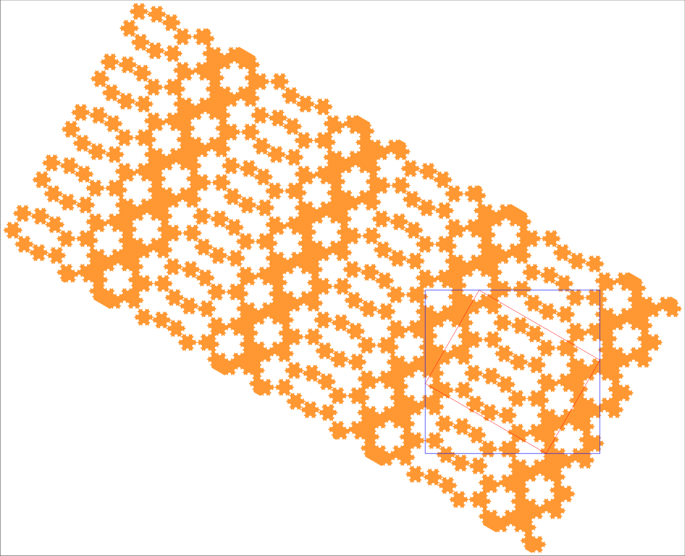

## Бесконечная анимация

Последнее, что необходимо определить – количество кадров, при котором произойдёт повтор. Рассмотрим следующее изображение:

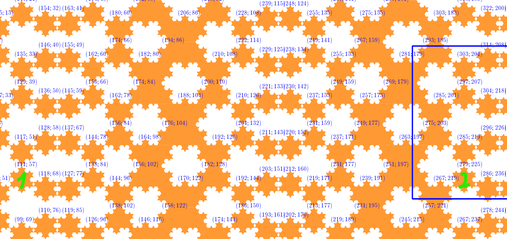

Повтор произойдёт, когда снежинка с номером $1$ займёт место снежинки под номером $2$. Определим это расстояние. Между этими снежинками находится $16$ снежинок, причём между ними происходит $2$ растяжения. Следовательно, расстояние между ними

$$
S(i) = 16\cdot 3^{i-1} + 2\cdot 6\cdot (i-1).
$$

Для $i = 3$ получим $S = 168$. Это можно проверить по изображению: у снежинки $2$ координаты $(279,225)$, у снежинки $1$ – $(111,57)$, разность составляет $(168,168)$.

Мы уже знаем, что за `all_frames` происходит смещение на $u(i) = 12\cdot(i-1)$. Тогда

$$
K(i) = \frac{S(i)}{u(i)} = \frac{16\cdot 3^{i-1} + 2\cdot 6\cdot (i-1)}{12\cdot(i-1)}.
$$

При разных $i$ получаем:

| $i$ | 3 | 4 | 5 | 6 | 7 |
|------|---|---|---|---|---|
| $K(i)$ | 7 | 13 | 28 | $\frac{329}{5}$ | 163 |

Таким образом, для $i = 3$ необходимо $7\cdot \text{all\_frames} = 7\cdot 16\cdot \text{steps}$ кадров. Поскольку мы положили `steps = 4`, потребуется $7\cdot 16 \cdot 4 = 448$ кадров. Если задержка между кадрами такая же, как в видео (100 мс), то длина видео составит $448 \cdot 0.1 = 44.8$ секунды.

Для примера рассмотрим конкретный случай, чтобы оценить вес и время выполнения. Сохраним все $449$ кадров в PDF-файлы. Размер одного кадра – $1200\times 1200$. На это Asymptote потратил около $3$ минут; суммарный вес всех файлов – $7.2$ МБ. Затем создадим GIF с помощью ImageMagick. Поскольку используется всего $2$ цвета, предварительно создадим палитру:

```bash
convert xc:white xc:orange +append palette.png
```

Затем выполним:

```bash
time convert -density 96 -delay 10 -loop 0 -layers Optimize -colors 2 -dither None -remap ./palette.png frames/frame_{0001..0449}.pdf animation_449.gif
```

Результат:  
real 7m54.040s, user 8m34.427s, sys 1m51.682s.  
Итоговый размер GIF – 22 МБ. Длительность – 44.90 секунд.

Следует быть осторожным: в процессе работы `convert` потреблял до 64 ГБ оперативной памяти (в основном из-за `-density 96`, приводящего к кадрам $1600\times 1493$).

Дополнительно можно выполнить оптимизацию с помощью `gifsicle`:

```bash
time gifsicle -O3 --lossy=80 --colors 2 animation_449.gif -o animation_449_opt.gif
```

Результат: real 2m21.253s, user 2m20.780s, sys 0m0.039s.  
Размер файла уменьшился до 16 МБ (без изменения разрешения).


Полный код анимации можной натий в [asy/main_animation.asy](asy/main_animation.asy);

Конечно, можно. Из PDF-файлов можно создать PNG-файлы произвольного размера, а вместо GIF-файлов создать, например, MP4 или WebP. Можно также изменить цвет, скорость, угол наклона и номер итерации.

## Вывод

Мы подробно разобрали математические основы построения кривой и снежинки Коха, вывели рекуррентные формулы с возможностью сдвига и поворота, описали операции растяжения/сжатия для отдельных частей снежинки, построили видимую область и вычислили период анимации. Реализация на Asymptote показала практическую возможность создания длительной анимации с высоким качеством и приемлемым размером файлов. Полученный GIF-файл (449 кадров, 44.9 секунды) имеет размер 16 МБ после дополнительной оптимизации. Предложенный подход может быть адаптирован для других языков программирования и позволяет создавать бесконечные анимации с периодическим повторением паттерна.
